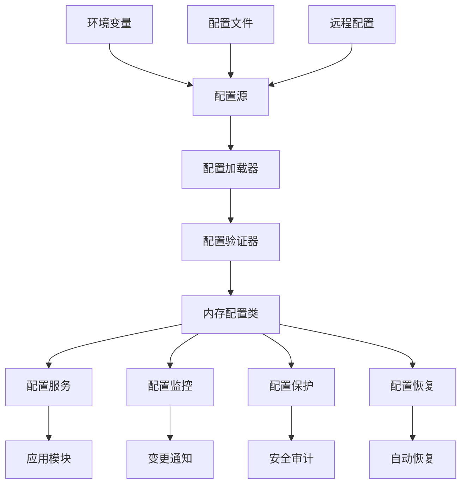
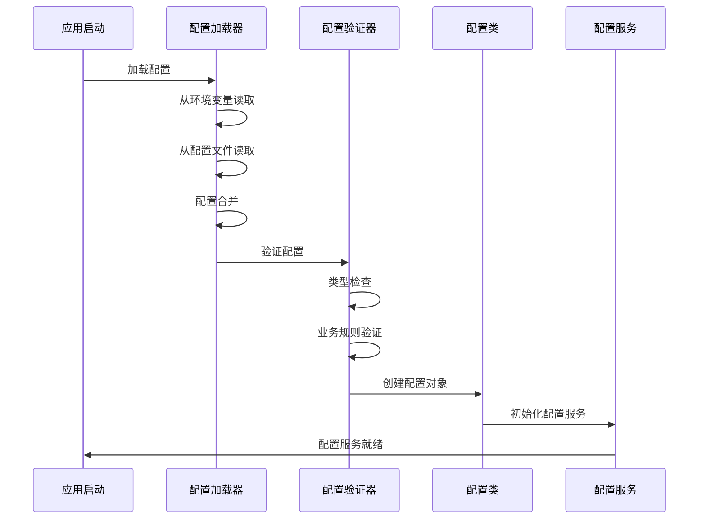
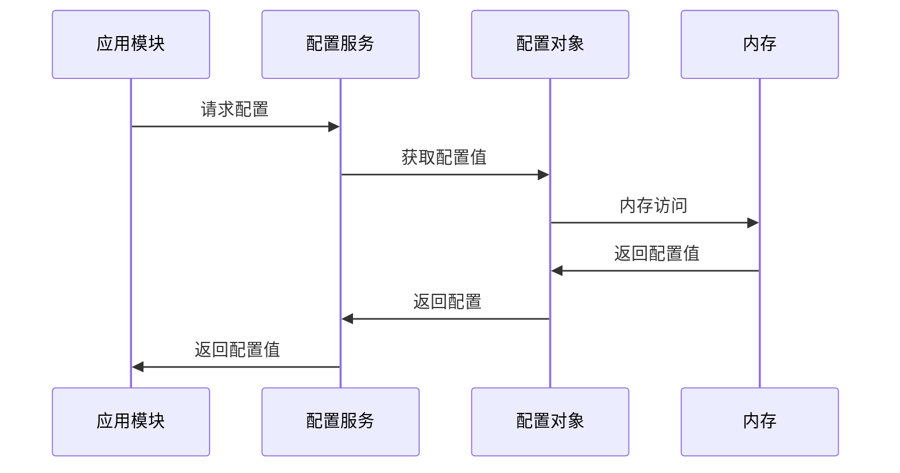

# 配置模块技术设计方案

## 📋 文档信息

- **文档版本**: 1.0.0
- **创建日期**: 2024-12-19
- **最后更新**: 2024-12-19
- **设计者**: HL8 SAAS平台架构团队
- **适用范围**: HL8 SAAS平台配置模块

## 🎯 设计目标

### 核心目标

1. **配置隔离**: 配置与环境变量完全分离，不受外部环境影响
2. **类型安全**: 提供强类型配置类，编译时类型检查
3. **性能优化**: 内存访问比环境变量读取更快
4. **配置锁定**: 配置一旦加载就无法被外部修改
5. **版本控制**: 配置变更可以版本化管理
6. **多租户支持**: 支持不同租户的配置隔离

### 业务目标

1. **高可用性**: 配置变更不影响应用稳定性
2. **安全性**: 敏感配置的安全存储和访问
3. **可维护性**: 配置的集中管理和版本控制
4. **可扩展性**: 支持新配置项的快速添加
5. **可观测性**: 配置变更的审计和监控

## 🏗️ 架构设计

### 整体架构



### 核心组件

#### 1. 配置源 (Configuration Sources)

- **环境变量**: 从环境变量读取配置
- **配置文件**: 从JSON/YAML文件读取配置
- **远程配置**: 从配置中心读取配置
- **默认配置**: 内置默认配置值

#### 2. 配置加载器 (Configuration Loader)

- **配置合并**: 多源配置的优先级合并
- **类型转换**: 字符串到强类型的转换
- **配置验证**: 加载时的配置验证
- **错误处理**: 配置加载失败的处理

#### 3. 内存配置类 (In-Memory Configuration Classes)

- **强类型定义**: TypeScript接口和类
- **配置锁定**: 运行时配置不可修改
- **类型安全**: 编译时类型检查
- **性能优化**: 内存访问优化

#### 4. 配置服务 (Configuration Service)

- **统一接口**: 提供统一的配置访问接口
- **类型安全**: 强类型配置访问
- **缓存机制**: 配置访问缓存
- **依赖注入**: NestJS依赖注入支持

## 🔧 技术实现

### 1. 配置类设计

#### 基础配置接口

```typescript
/**
 * 基础配置接口
 * 
 * @description 所有配置类的基接口
 * 提供配置的基础属性和方法
 */
export interface IBaseConfig {
  /** 配置版本 */
  readonly version: string;
  /** 配置环境 */
  readonly environment: string;
  /** 配置创建时间 */
  readonly createdAt: Date;
  /** 配置更新时间 */
  readonly updatedAt: Date;
  /** 配置是否有效 */
  readonly isValid: boolean;
}
```

#### 应用配置类

```typescript
/**
 * 应用配置类
 * 
 * @description 应用程序的核心配置类
 * 包含API、数据库、认证等所有配置项
 */
export class ApplicationConfig implements IBaseConfig {
  // 基础属性
  readonly version: string;
  readonly environment: string;
  readonly createdAt: Date;
  readonly updatedAt: Date;
  readonly isValid: boolean;

  // API配置
  readonly api: ApiConfig;
  
  // 数据库配置
  readonly database: DatabaseConfig;
  
  // 认证配置
  readonly auth: AuthConfig;
  
  // Redis配置
  readonly redis: RedisConfig;
  
  // 日志配置
  readonly logging: LoggingConfig;
  
  // 功能开关
  readonly features: FeaturesConfig;

  constructor(configData: any) {
    // 基础属性设置
    this.version = configData.version || '1.0.0';
    this.environment = configData.environment || 'development';
    this.createdAt = new Date();
    this.updatedAt = new Date();
    this.isValid = true;

    // 子配置初始化
    this.api = new ApiConfig(configData.api);
    this.database = new DatabaseConfig(configData.database);
    this.auth = new AuthConfig(configData.auth);
    this.redis = new RedisConfig(configData.redis);
    this.logging = new LoggingConfig(configData.logging);
    this.features = new FeaturesConfig(configData.features);
  }

  /**
   * 获取配置摘要
   * 
   * @description 获取配置的摘要信息，用于日志和监控
   * @returns {ConfigSummary} 配置摘要
   */
  getSummary(): ConfigSummary {
    return {
      version: this.version,
      environment: this.environment,
      isValid: this.isValid,
      lastUpdated: this.updatedAt,
      configCount: this.getConfigCount()
    };
  }

  /**
   * 获取配置数量
   * 
   * @description 获取配置项的总数量
   * @returns {number} 配置项数量
   * @private
   */
  private getConfigCount(): number {
    return Object.keys(this).length;
  }
}
```

#### 子配置类示例

```typescript
/**
 * API配置类
 * 
 * @description API相关的配置项
 */
export class ApiConfig {
  readonly port: number;
  readonly host: string;
  readonly baseUrl: string;
  readonly clientBaseUrl: string;
  readonly production: boolean;
  readonly envName: string;

  constructor(configData: any) {
    this.port = parseInt(configData.port || '3000');
    this.host = configData.host || 'http://localhost';
    this.baseUrl = configData.baseUrl || 'http://localhost:3000';
    this.clientBaseUrl = configData.clientBaseUrl || 'http://localhost:4200';
    this.production = configData.production || false;
    this.envName = configData.envName || 'development';
  }
}

/**
 * 数据库配置类
 * 
 * @description 数据库相关的配置项
 */
export class DatabaseConfig {
  readonly type: string;
  readonly host: string;
  readonly port: number;
  readonly name: string;
  readonly username: string;
  readonly password: string;
  readonly sslMode: boolean;
  readonly logging: boolean;
  readonly poolSize: number;
  readonly connectionTimeout: number;
  readonly idleTimeout: number;

  constructor(configData: any) {
    this.type = configData.type || 'postgresql';
    this.host = configData.host || 'localhost';
    this.port = parseInt(configData.port || '5432');
    this.name = configData.name || 'aiofix_platform';
    this.username = configData.username || 'aiofix_user';
    this.password = configData.password || 'aiofix_password';
    this.sslMode = configData.sslMode === 'true';
    this.logging = configData.logging === 'true';
    this.poolSize = parseInt(configData.poolSize || '40');
    this.connectionTimeout = parseInt(configData.connectionTimeout || '5000');
    this.idleTimeout = parseInt(configData.idleTimeout || '10000');
  }
}
```

### 2. 配置加载器设计

#### 配置加载器接口

```typescript
/**
 * 配置加载器接口
 * 
 * @description 定义配置加载器的标准接口
 */
export interface IConfigLoader {
  /**
   * 加载配置
   * 
   * @description 从配置源加载配置数据
   * @returns {Promise<any>} 配置数据
   */
  load(): Promise<any>;

  /**
   * 验证配置
   * 
   * @description 验证配置数据的有效性
   * @param {any} config - 配置数据
   * @returns {Promise<ValidationResult>} 验证结果
   */
  validate(config: any): Promise<ValidationResult>;

  /**
   * 获取配置源信息
   * 
   * @description 获取配置源的基本信息
   * @returns {ConfigSourceInfo} 配置源信息
   */
  getSourceInfo(): ConfigSourceInfo;
}
```

#### 环境变量加载器

```typescript
/**
 * 环境变量配置加载器
 * 
 * @description 从环境变量加载配置数据
 */
export class EnvironmentConfigLoader implements IConfigLoader {
  private readonly logger = new PinoLogger({
    level: 'info',
    destination: { type: 'console' }
  });

  /**
   * 加载配置
   * 
   * @description 从环境变量加载配置数据
   * @returns {Promise<any>} 配置数据
   */
  async load(): Promise<any> {
    this.logger.info('从环境变量加载配置');

    const config = {
      // API配置
      api: {
        port: process.env.API_PORT || '3000',
        host: process.env.API_HOST || 'http://localhost',
        baseUrl: process.env.API_BASE_URL || 'http://localhost:3000',
        clientBaseUrl: process.env.CLIENT_BASE_URL || 'http://localhost:4200',
        production: process.env.NODE_ENV === 'production',
        envName: process.env.NODE_ENV || 'development',
      },

      // 数据库配置
      database: {
        type: process.env.DB_TYPE || 'postgresql',
        host: process.env.DB_HOST || 'localhost',
        port: process.env.DB_PORT || '5432',
        name: process.env.DB_NAME || 'aiofix_platform',
        username: process.env.DB_USER || 'aiofix_user',
        password: process.env.DB_PASS || 'aiofix_password',
        sslMode: process.env.DB_SSL_MODE === 'true',
        logging: process.env.DB_LOGGING === 'true',
        poolSize: process.env.DB_POOL_SIZE || '40',
        connectionTimeout: process.env.DB_CONNECTION_TIMEOUT || '5000',
        idleTimeout: process.env.DB_IDLE_TIMEOUT || '10000',
      },

      // 认证配置
      auth: {
        jwtSecret: process.env.JWT_SECRET || 'your-secret-key',
        jwtExpiresIn: process.env.JWT_EXPIRES_IN || '24h',
        passwordSaltRounds: parseInt(process.env.PASSWORD_SALT_ROUNDS || '10'),
      },

      // Redis配置
      redis: {
        host: process.env.REDIS_HOST || 'localhost',
        port: process.env.REDIS_PORT || '6379',
        password: process.env.REDIS_PASSWORD || '',
        db: process.env.REDIS_DB || '0',
      },

      // 日志配置
      logging: {
        level: process.env.LOG_LEVEL || 'info',
        format: process.env.LOG_FORMAT || 'json',
        destination: process.env.LOG_DESTINATION || 'console',
      },

      // 功能开关
      features: {
        enableSwagger: process.env.ENABLE_SWAGGER === 'true',
        enableMetrics: process.env.ENABLE_METRICS === 'true',
        enableCors: process.env.ENABLE_CORS === 'true',
      }
    };

    this.logger.info('环境变量配置加载完成', {
      configKeys: Object.keys(config),
      environment: config.api.envName
    });

    return config;
  }

  /**
   * 验证配置
   * 
   * @description 验证配置数据的有效性
   * @param {any} config - 配置数据
   * @returns {Promise<ValidationResult>} 验证结果
   */
  async validate(config: any): Promise<ValidationResult> {
    const errors: string[] = [];
    const warnings: string[] = [];

    // 验证API配置
    if (!config.api?.port || isNaN(parseInt(config.api.port))) {
      errors.push('API端口配置无效');
    }

    if (!config.api?.host) {
      errors.push('API主机配置无效');
    }

    // 验证数据库配置
    if (!config.database?.host) {
      errors.push('数据库主机配置无效');
    }

    if (!config.database?.name) {
      errors.push('数据库名称配置无效');
    }

    // 验证认证配置
    if (!config.auth?.jwtSecret || config.auth.jwtSecret.length < 32) {
      warnings.push('JWT密钥长度不足，建议使用32位以上密钥');
    }

    return {
      isValid: errors.length === 0,
      errors,
      warnings
    };
  }

  /**
   * 获取配置源信息
   * 
   * @description 获取配置源的基本信息
   * @returns {ConfigSourceInfo} 配置源信息
   */
  getSourceInfo(): ConfigSourceInfo {
    return {
      type: 'environment',
      name: '环境变量',
      description: '从环境变量加载配置',
      priority: 1,
      isReadOnly: true
    };
  }
}
```

#### 配置文件加载器

```typescript
/**
 * 配置文件加载器
 * 
 * @description 从JSON/YAML文件加载配置数据
 */
export class FileConfigLoader implements IConfigLoader {
  private readonly logger = new PinoLogger({
    level: 'info',
    destination: { type: 'console' }
  });

  constructor(
    private readonly filePath: string,
    private readonly fileType: 'json' | 'yaml' = 'json'
  ) {}

  /**
   * 加载配置
   * 
   * @description 从配置文件加载配置数据
   * @returns {Promise<any>} 配置数据
   */
  async load(): Promise<any> {
    this.logger.info('从配置文件加载配置', { filePath: this.filePath });

    try {
      const fileContent = await fs.readFile(this.filePath, 'utf-8');
      
      let config: any;
      if (this.fileType === 'json') {
        config = JSON.parse(fileContent);
      } else if (this.fileType === 'yaml') {
        config = yaml.load(fileContent);
      } else {
        throw new Error(`不支持的文件类型: ${this.fileType}`);
      }

      this.logger.info('配置文件加载完成', {
        filePath: this.filePath,
        configKeys: Object.keys(config)
      });

      return config;
    } catch (error) {
      this.logger.error('配置文件加载失败', {
        filePath: this.filePath,
        error: error instanceof Error ? error.message : String(error)
      });
      throw error;
    }
  }

  /**
   * 验证配置
   * 
   * @description 验证配置数据的有效性
   * @param {any} config - 配置数据
   * @returns {Promise<ValidationResult>} 验证结果
   */
  async validate(config: any): Promise<ValidationResult> {
    // 使用通用的配置验证逻辑
    return await this.validateConfigStructure(config);
  }

  /**
   * 获取配置源信息
   * 
   * @description 获取配置源的基本信息
   * @returns {ConfigSourceInfo} 配置源信息
   */
  getSourceInfo(): ConfigSourceInfo {
    return {
      type: 'file',
      name: '配置文件',
      description: `从${this.fileType.toUpperCase()}文件加载配置`,
      priority: 2,
      isReadOnly: false,
      filePath: this.filePath
    };
  }

  /**
   * 验证配置结构
   * 
   * @description 验证配置数据的结构
   * @param {any} config - 配置数据
   * @returns {Promise<ValidationResult>} 验证结果
   * @private
   */
  private async validateConfigStructure(config: any): Promise<ValidationResult> {
    const errors: string[] = [];
    const warnings: string[] = [];

    // 验证必需的配置项
    const requiredKeys = ['api', 'database', 'auth'];
    for (const key of requiredKeys) {
      if (!config[key]) {
        errors.push(`缺少必需的配置项: ${key}`);
      }
    }

    return {
      isValid: errors.length === 0,
      errors,
      warnings
    };
  }
}
```

### 3. 配置服务设计

#### 配置服务接口

```typescript
/**
 * 配置服务接口
 * 
 * @description 定义配置服务的标准接口
 */
export interface IConfigService {
  /**
   * 获取配置
   * 
   * @description 获取指定路径的配置值
   * @param {string} path - 配置路径
   * @returns {T} 配置值
   */
  get<T>(path: string): T;

  /**
   * 获取配置（带默认值）
   * 
   * @description 获取指定路径的配置值，如果不存在则返回默认值
   * @param {string} path - 配置路径
   * @param {T} defaultValue - 默认值
   * @returns {T} 配置值
   */
  get<T>(path: string, defaultValue: T): T;

  /**
   * 检查配置是否存在
   * 
   * @description 检查指定路径的配置是否存在
   * @param {string} path - 配置路径
   * @returns {boolean} 是否存在
   */
  has(path: string): boolean;

  /**
   * 获取所有配置
   * 
   * @description 获取所有配置数据
   * @returns {ApplicationConfig} 配置对象
   */
  getAll(): ApplicationConfig;

  /**
   * 重新加载配置
   * 
   * @description 重新加载配置数据
   * @returns {Promise<void>}
   */
  reload(): Promise<void>;
}
```

#### 配置服务实现

```typescript
/**
 * 配置服务实现
 * 
 * @description 提供统一的配置访问接口
 */
@Injectable()
export class ConfigService implements IConfigService {
  private config: ApplicationConfig | null = null;
  private readonly logger = new PinoLogger({
    level: 'info',
    destination: { type: 'console' }
  });

  constructor(
    private readonly configLoader: IConfigLoader,
    private readonly configValidator: IConfigValidator
  ) {}

  /**
   * 初始化配置
   * 
   * @description 初始化配置服务
   * @returns {Promise<void>}
   */
  async initialize(): Promise<void> {
    this.logger.info('初始化配置服务');

    try {
      // 加载配置
      const configData = await this.configLoader.load();
      
      // 验证配置
      const validationResult = await this.configValidator.validate(configData);
      if (!validationResult.isValid) {
        throw new Error(`配置验证失败: ${validationResult.errors.join(', ')}`);
      }

      // 创建配置对象
      this.config = new ApplicationConfig(configData);
      
      this.logger.info('配置服务初始化完成', {
        version: this.config.version,
        environment: this.config.environment,
        isValid: this.config.isValid
      });
    } catch (error) {
      this.logger.error('配置服务初始化失败', {
        error: error instanceof Error ? error.message : String(error)
      });
      throw error;
    }
  }

  /**
   * 获取配置
   * 
   * @description 获取指定路径的配置值
   * @param {string} path - 配置路径
   * @returns {T} 配置值
   */
  get<T>(path: string): T;
  get<T>(path: string, defaultValue: T): T;
  get<T>(path: string, defaultValue?: T): T {
    if (!this.config) {
      throw new Error('配置服务未初始化');
    }

    const value = this.getNestedValue(this.config, path);
    
    if (value === undefined && defaultValue !== undefined) {
      return defaultValue;
    }
    
    if (value === undefined) {
      throw new Error(`配置路径不存在: ${path}`);
    }
    
    return value as T;
  }

  /**
   * 检查配置是否存在
   * 
   * @description 检查指定路径的配置是否存在
   * @param {string} path - 配置路径
   * @returns {boolean} 是否存在
   */
  has(path: string): boolean {
    if (!this.config) {
      return false;
    }

    try {
      const value = this.getNestedValue(this.config, path);
      return value !== undefined;
    } catch {
      return false;
    }
  }

  /**
   * 获取所有配置
   * 
   * @description 获取所有配置数据
   * @returns {ApplicationConfig} 配置对象
   */
  getAll(): ApplicationConfig {
    if (!this.config) {
      throw new Error('配置服务未初始化');
    }

    return this.config;
  }

  /**
   * 重新加载配置
   * 
   * @description 重新加载配置数据
   * @returns {Promise<void>}
   */
  async reload(): Promise<void> {
    this.logger.info('重新加载配置');
    
    try {
      await this.initialize();
      this.logger.info('配置重新加载完成');
    } catch (error) {
      this.logger.error('配置重新加载失败', {
        error: error instanceof Error ? error.message : String(error)
      });
      throw error;
    }
  }

  /**
   * 获取嵌套值
   * 
   * @description 获取嵌套对象的属性值
   * @param {any} obj - 对象
   * @param {string} path - 路径
   * @returns {any} 属性值
   * @private
   */
  private getNestedValue(obj: any, path: string): any {
    return path.split('.').reduce((current, key) => {
      return current && current[key] !== undefined ? current[key] : undefined;
    }, obj);
  }
}
```

### 4. 配置模块设计

#### 配置模块

```typescript
/**
 * 配置模块
 * 
 * @description HL8 SAAS平台的配置模块
 * 提供统一的配置管理功能
 */
@Global()
@Module({
  imports: [],
  providers: [
    {
      provide: 'CONFIG_LOADER',
      useClass: EnvironmentConfigLoader
    },
    {
      provide: 'CONFIG_VALIDATOR',
      useClass: ConfigValidator
    },
    ConfigService
  ],
  exports: [ConfigService]
})
export class ConfigModule {
  /**
   * 配置模块初始化
   * 
   * @description 配置模块的初始化方法
   * @param {ModuleRef} moduleRef - 模块引用
   * @returns {Promise<void>}
   */
  static async onModuleInit(moduleRef: ModuleRef): Promise<void> {
    const configService = moduleRef.get(ConfigService);
    await configService.initialize();
  }
}
```

## 🔄 配置生命周期

### 1. 配置加载阶段



### 2. 配置访问阶段



## 🛡️ 安全设计

### 1. 配置隔离

- **内存隔离**: 配置存储在内存中，与外部环境完全隔离
- **类型安全**: 强类型配置类，编译时类型检查
- **访问控制**: 只读配置对象，防止运行时修改

### 2. 配置验证

- **结构验证**: 验证配置结构的完整性
- **类型验证**: 验证配置值的类型正确性
- **业务验证**: 验证业务规则的符合性

### 3. 配置保护

- **配置锁定**: 配置加载后不可修改
- **变更监控**: 监控配置变更尝试
- **审计日志**: 记录配置访问和变更

## 📊 性能设计

### 1. 内存优化

- **配置缓存**: 配置数据缓存在内存中
- **懒加载**: 按需加载配置项
- **对象池**: 重用配置对象实例

### 2. 访问优化

- **直接访问**: 内存直接访问，无需环境变量读取
- **类型缓存**: 类型信息缓存
- **路径优化**: 配置路径解析优化

### 3. 加载优化

- **并行加载**: 多配置源并行加载
- **增量更新**: 支持配置增量更新
- **缓存策略**: 智能缓存策略

## 🔧 扩展设计

### 1. 配置源扩展

- **数据库配置**: 从数据库读取配置
- **远程配置**: 从配置中心读取配置
- **加密配置**: 支持加密配置存储

### 2. 配置类型扩展

- **动态配置**: 支持运行时配置更新
- **多租户配置**: 支持多租户配置隔离
- **环境配置**: 支持多环境配置管理

### 3. 配置功能扩展

- **配置热重载**: 支持配置热重载
- **配置版本控制**: 支持配置版本管理
- **配置回滚**: 支持配置回滚功能

## 📈 监控设计

### 1. 配置监控

- **配置加载监控**: 监控配置加载性能
- **配置访问监控**: 监控配置访问频率
- **配置变更监控**: 监控配置变更情况

### 2. 性能监控

- **内存使用监控**: 监控配置内存使用
- **访问延迟监控**: 监控配置访问延迟
- **加载时间监控**: 监控配置加载时间

### 3. 错误监控

- **配置错误监控**: 监控配置相关错误
- **验证失败监控**: 监控配置验证失败
- **加载失败监控**: 监控配置加载失败

## 🧪 测试设计

### 1. 单元测试

- **配置类测试**: 测试配置类的功能
- **配置服务测试**: 测试配置服务的功能
- **配置加载器测试**: 测试配置加载器的功能

### 2. 集成测试

- **配置加载测试**: 测试配置加载流程
- **配置验证测试**: 测试配置验证功能
- **配置访问测试**: 测试配置访问功能

### 3. 性能测试

- **加载性能测试**: 测试配置加载性能
- **访问性能测试**: 测试配置访问性能
- **内存性能测试**: 测试配置内存使用

## 📚 使用示例

### 1. 基本使用

```typescript
import { ConfigService } from '@hl8/config';

@Injectable()
export class MyService {
  constructor(private readonly configService: ConfigService) {}

  getApiPort(): number {
    return this.configService.get<number>('api.port');
  }

  getDatabaseHost(): string {
    return this.configService.get<string>('database.host');
  }
}
```

### 2. 高级使用

```typescript
import { ConfigService } from '@hl8/config';

@Injectable()
export class AdvancedService {
  constructor(private readonly configService: ConfigService) {}

  async initialize(): Promise<void> {
    // 检查配置是否存在
    if (this.configService.has('api.port')) {
      const port = this.configService.get<number>('api.port');
      console.log(`API端口: ${port}`);
    }

    // 获取带默认值的配置
    const timeout = this.configService.get<number>('api.timeout', 5000);
    console.log(`API超时: ${timeout}ms`);

    // 获取所有配置
    const allConfig = this.configService.getAll();
    console.log('配置摘要:', allConfig.getSummary());
  }
}
```

## 🎯 总结

### 设计优势

1. **完全隔离**: 配置与环境变量完全分离
2. **类型安全**: 强类型配置类，编译时检查
3. **性能优化**: 内存访问，性能优异
4. **配置锁定**: 运行时配置不可修改
5. **版本控制**: 支持配置版本管理

### 技术特点

1. **内存配置**: 配置存储在内存中，访问快速
2. **强类型**: TypeScript强类型支持
3. **模块化**: 清晰的模块化设计
4. **可扩展**: 支持多种配置源和扩展
5. **可监控**: 完整的监控和审计功能

### 适用场景

1. **高可用应用**: 需要稳定配置的应用
2. **多租户系统**: 需要配置隔离的系统
3. **微服务架构**: 需要配置管理的微服务
4. **企业应用**: 需要配置安全的企业应用

这个设计方案提供了完整的配置管理解决方案，既保证了配置的安全性和稳定性，又提供了良好的性能和扩展性。
